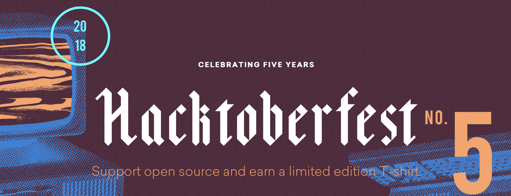

# Hacktoberfest 2018 for Beginners



Use this project to make your first contribution to an open source project on GitHub. Practice making your first pull request to a public repository before doing the real thing!

Celebrate [Hacktoberfest](https://hacktoberfest.digitalocean.com/) by getting involved in the open source community by completing some simple tasks in this project.

This repository is open to all members of the GitHub community. Any member may contribute to this project without being a collaborator.

## What is Hacktoberfest?
Hacktoberfest is a month-long celebration of open source software run by DigitalOcean in partnership with GitHub and Twilio.

- Hacktoberfest is open to everyone in our global community!
- Five quality pull requests must be submitted to public GitHub repositories.
- You can sign up anytime between October 1 and October 31.

## How to contribute to this project
Here are 3 quick and painless ways to contribute to this project:

* Add your name to the `CONTRIBUTORS.md` file
* Add a profile page to the `profiles` directory
* Create a simple "Hello, World" script in a language of your choice

Choose one or all 3, make a pull request for your work and wait for it to be merged!

## Getting started
* Fork this repository (Click the Fork button in the top right of this page, click your Profile Image)
* Clone your fork down to your local machine

```markdown
git clone https://github.com/your-username/hacktoberfest.git
```

* Create a branch

```markdown
git checkout -b branch-name
```

* Make your changes (choose from any task below)
* Commit and push

```markdown
git add .
git commit -m 'Commit message'
git push origin branch-name
```

* Create a new pull request from your forked repository (Click the `New Pull Request` button located at the top of your repo)
* Wait for your PR review and merge approval!
* __Star this repository__ if you had fun!

## Choose from these tasks
### 1. Add your name
Add your name to the `CONTRIBUTORS.md` file using the below convention:

```markdown
- [YOUR NAME](GitHub link)
```

### 2. Add a profile page
Add a `Your_Name.md` file to the `profiles` directory. Use any combination of content and Markdown you'd like. Here is an example:

```markdown
# Your Name

### Location

Your City, Country

### Education

Your School

### Skills

- Your Skills
```

### 3. Create a `Hello, World!` Script
Add a `hello_world_yourusername.xx` script to the `scripts` directory in any language of your choice! Here is an example:

```python
#LANGUAGE: python
#AUTHOR: Jeongwhan Choi
# GITHUB: https://github.com/jeongwhanchoi

print("Hello world!")
```

Name the file `hello_world_yourusername.xx`. e.g., `hello_world_jeongwhanchoi.js` or `hello_world_jeongwhanchoi.py`.

Don't forget to include the comments as seen above. Feel free to include additional information about the language you choose.
